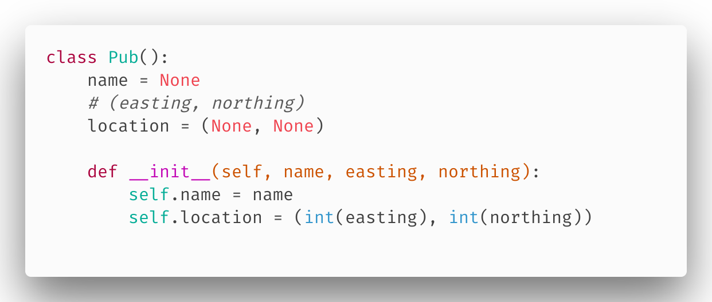
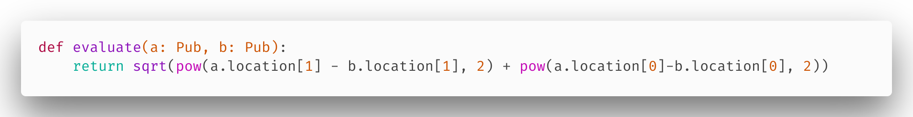
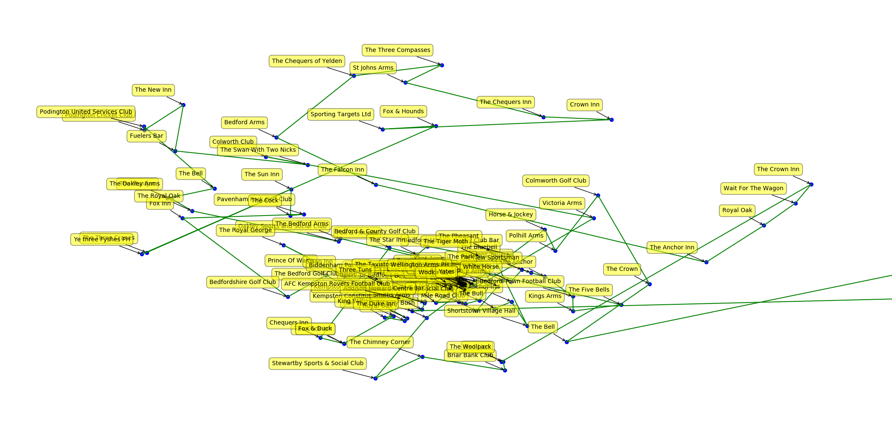

# Projet IA : ACO-Ants

## Utilisation:

installation
`pip install -r requirements.txt`
`python main.py`
L'objectif de ce TP est de trouver le meilleur initénaire pour faire le tour de tous les pubs d'angleterre, en utilisant un algorithme de type 'colonie de fourmies'

## le modèle de données :

Dans le fichier CSV, la donnée est formatée de cette manière :

`"24","Anchor Inn","Upper Street, Stratford St Mary, COLCHESTER, Essex","CO7 6LW","604748","234405","51.970390","0.979328","Babergh"`

Afin de travailler plus facilement avec ces données, une classe python semblait être un bonne idée.

## la fonction d'évalutaion:

cette fonction permet de noter la route qui a été prise par une fourmi, afin savoir la quantité d'enzymes qu'elle laissera sur le chemin. On utilise la distance euclideene, pour connaitre la distance entre 2 points, ainsi la fourmi aura tendance a se rendre dans le bar le plus proche, si elle ne l'a pas déja visité.
Petit bonus: cette fontion utilise le typage, disponible depuis python 3.6.7

Screenshot du résultat final (pour 500 bars uniquement) :

github : https://github.com/NathanGrimaud/epsi-aco-pants
